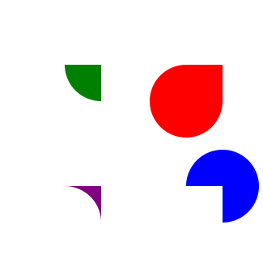

# orign-only-exmple


## Mathjax!
Inline math: $e^{i\pi}=-1$
<details>
  <summary>TeX code</summary>
  
  ``` TeX
  Inline math: $e^{i\pi}=-1$
  ```
  
</details>

#### Math block
$$\int_0^\infty \text{This is an indefinite intagral}$$
<details>
  <summary>TeX code</summary>
  
  ``` TeX
  $$\int_0^\infty \text{This is an indefinite intagral}$$
  ```
  
</details>

## SVG!
#### Done with an image tag which has src equal to a relative path/filename

<details><summary>HTML/Markdown</summary>
  
  ``` Html
  
  ```
  
</details>

#### Trying to get inline svg to work
{::nomarkdown}
    <?xml version="1.0" encoding="UTF-8"?>
    <!DOCTYPE svg PUBLIC "-//W3C//DTD SVG 1.1//EN" "http://www.w3.org/Graphics/SVG/1.1/DTD/svg11.dtd">
    <svg xmlns="http://www.w3.org/2000/svg" version="1.1" width="121px" height="81px" viewBox="-0.5 -0.5 121 81" style="background-color: rgb(255, 255, 255);">
        <defs/>
        <g>
            <ellipse cx="60" cy="40" rx="60" ry="40" fill="#ffffff" stroke="#000000" pointer-events="all"/>
        </g>
    </svg>
{:/nomarkdown}
